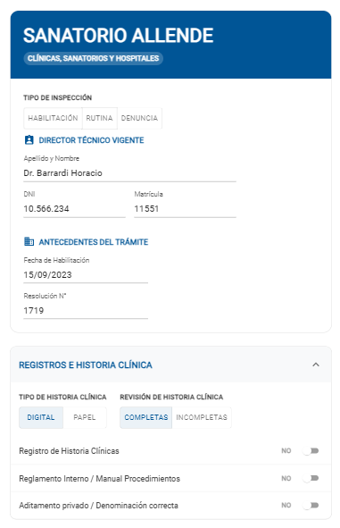
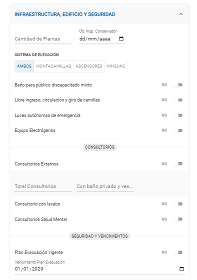
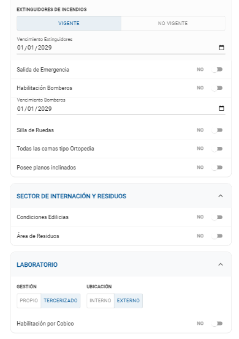
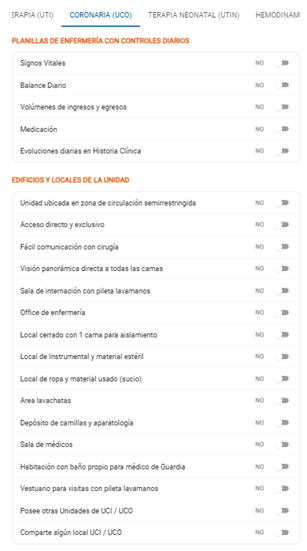
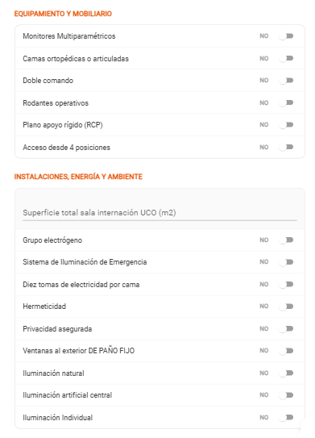

# 10.1.1 - Registrar Acta de Inspeccion - Acta de Inspección

> **Como** usuario con perfil autorizado (Agente inspector)  
> **Quiero** registrar datos y documentación correspondiente al acta de inspección general
> **Para** dejar registro de la inspección realizada.  

## 📝 DESCRIPCIÓN
Esta sección de la funcionalidad se enfoca en el aspecto técnico de la inspección.
Solo se habilita una vez que el inspector ha presionado [GUARDAR] en la pestaña de "Observaciones Trámite". Luego puede navegar libremente entre las pestañas.

Al ingresar, el sistema precarga los datos del Director Técnico y los antecedentes del establecimiento (Fecha y Resolución de habilitación anterior) en modo solo lectura.

El cuerpo del acta de inspección se divide en módulos desplegables (Acordeones):

1. Registros e Historia Clínica: Control de manuales y tipo de soporte (Digital/Papel).
2. Infraestructura, Edificio y Seguridad: Control de plantas, ascensores, matafuegos y planos.
3. Sector de internación y residuos: condiciones edilicias y área de residuos.
4. Laboratorio: gestión, ubicación y habilitación del mismo.
5. Servicios Específicos: pestañas para los servicios seleccionados por el efector (sólo si seleccionó UTI, UCO, UTIN y/o Hemodiálisis). 
   1. UTI
      1. Switches
         1. Controles: Signos vitales, Balance diario, Volúmenes de ingresos y egresos, Medicación.
         2. Infraestrutura: Unidad en zona semirrestringida, Visión panorámica a todas las camas, Sala de internación c/pileta lavamanos, Office de enfermería, Local cerrado p/ 1 cama aislamiento, Area lavachatas, Depósito de camillas y aparatología, Sala de médicos, Habitación c/baño para médico de Guardia, Vestuario para visitas c/pileta lavamanos.
         3. Equipamento: Monitores Multiparamétricos, Camas ortopédicas o articuladas, Doble comando, Rodantes operativos, Doble circuito de energía eléctrica, Diez tomas de electricidad por cama, Acceso desde 4 posiciones.
      2. Inputs numéricos
         1. Superficie total sala internación (m2).
   2. UCO
      1. Switches
         1. Controles: Signos vitales, Balance diario, Volúmenes de ingresos y egresos, Medicación.
         2. Infraestrutura: Unidad en zona semirrestringida, Visión panorámica a todas las camas, Sala de internación c/pileta lavamanos, Office de enfermería, Local cerrado p/ 1 cama aislamiento, Area lavachatas, Depósito de camillas y aparatología, Sala de médicos, Habitación c/baño para médico de Guardia, Vestuario para visitas c/pileta lavamanos.
         3. Equipamento: Monitores Multiparamétricos, Camas ortopédicas o articuladas, Doble comando, Rodantes operativos, Doble circuito de energía eléctrica, Diez tomas de electricidad por cama, Acceso desde 4 posiciones.
      2. Inputs numéricos
         1. Superficie total sala internación (m2).
   3. UTIN
         1. Switches
            1. Controles: Signos vitales, Volúmenes de ingresos y egresos, Balance Diario, Medicación, Cronograma de trabajo.
            2. Infraestrutura: Unidad en zona semirrestringida, Visión panorámica directa a todas las camas, Sala de internación c/pileta lavamanos, Local de Instrumental y material estéril, Office de enfermería con monitores, Local cerrado c/2 unidades para aislamiento, Area de deposito ropa limpia, Lavabo propio en la unidad, Local de ropa y material usado (sucio), Vestuario para visitas c/pileta lavamanos, Pileta para material, Depósito para incubadora/cuna/aparatos, Local de formulas lácteas (Lactario), Sala de médicos, Sanitarios para el personal, Armario con llave.
            3. Higiene e Ação: Dispensador de jabon liquido y Toalla de papel, Accionamiento a codo, Accionamiento a pie, Accionamiento a electricidad.
            4. Equipamento e Apoio: Ocho tomas de electricidad por cama con tablero independiente, Consola de monitoreo / Incubadoras / Cunas, Repisa individual / Fuente de Oxígeno / Aspiración, Aire comprimido por unidad, Extractor de aire con filtro, Sistema calefacción / refrigeración / ventilación, Fácil comunicación c/cirugía, Privacidad en unidades de aislamiento, Ventanas al exterior de paño fijo, Iluminacion natural, Iluminacion artificial central, Iluminacion individual difusa, Laboratorio Bioquímico, Radiología, Hemoterapia.
         2. Inputs numéricos
            1. Superficie total sala internación (m2).
   4. HEMODIALISIS
      1. Switches
         1. Unidad de Diálisis Independiente, Reglamento Interno, Plan de Evacuación / Habilitación Bomberos, Convenio de Internación, Normas de Procedimientos (Médicos y Enfermeras), Normas de bioseguridad expuestas, Registro Historia Clínica completa, Registro de Psicofármacos Actualizado, Registro de Enfermedades Transmisibles, Libro de Reusos, Planillas de Personal Enfermería, Nro de Inscripción de pacientes al INCUCAI y/o ECODAI, Carpetas de Inscripción de pacientes al INCUCAI / ECODAI.
         2. Análisis Físico-Químico, Análisis Bacteriológico.
         3. VIH (Pacientes), Hepatitis B (Pacientes), Hepatitis C (Pacientes), VIH (Personal), Hepatitis B (Personal), Hepatitis C (Personal).
      2. Fechas
         1. Fecha último Físico-Químico.
         2. Fecha último Bacteriológico.
      3. Inputs texto
         1. Observaciones de la Unidad de Diálisis (Campo largo).

## ✅ CRITERIOS DE ACEPTACIÓN

1. Cumplir con los criterios definidos en el documento de estilo institucional.
2. La interfaz debe estar optimizada para uso en dispositivos móviles (Tablets 1280x800 px), asegurando que todos los controles (botones, tablas, modales) sean táctiles y legibles.
3. El sistema debe presentar un Encabezado Unificado que contenga: Nombre del Establecimiento, Tipología, Tipo de Inspección (Habilitación/Rutina/Denuncia) y datos del Director Técnico (DNI/Matrícula) recuperados del trámite.
4. Los campos "Fecha de Habilitación" y "Resolución N°" deben mostrarse inhabilitados.
5. La sección de Registros debe permitir seleccionar el "Tipo de Historia Clínica" (Digital/Papel) y el "Estado de Revisión" (Completas/Incompletas) mediante botones excluyentes.
6. La sección de Infraestructura debe agrupar los controles de ascensores (Ambos/Montacamillas/Ascensores/Ninguno) mediante botones de selección única.
7. El sistema debe permitir el ingreso de Fechas de Vencimiento (Plan de Evacuación, Bomberos, Extinguidores) mediante selectores de fecha (Datepicker) integrados debajo de cada switch de vigencia.
8. Los apartados de servicios críticos (UTI, UCO, UTIN, HEMO) deben estar organizados en Pestañas independientes para optimizar el espacio en pantalla.
9. Cada ítem de inspección (Switch) debe cambiar su color de fondo cuando el estado sea "SÍ"..
10. En la pestaña UTIN, se debe incluir un bloque específico para "Servicios de Apoyo" (Laboratorio, Radiología, Hemoterapia) y "Cronograma de Trabajo".
11. El sistema debe generar un Resumen de Observaciones automático que concatene los ítems marcados como "NO" en las pestañas de auditoría y las observaciones manuales del acta.
12. Si la Criticidad seleccionada es "GRAVE", el botón [APROBAR] debe inhabilitarse, permitiendo únicamente la acción [NO APROBAR].
13. Para habilitar el botón [APROBAR], es obligatorio que el inspector ingrese al menos una Nota de Cierre.
14. Al presionar [NO APROBAR], el sistema debe desplegar un modal de confirmación solicitando un Motivo de Rechazo obligatorio. Una vez confirmado, el trámite cambia al estado "Observado Inspección".
15. El botón flotante [GUARDAR] debe persistir todos los datos cargados en la base de datos sin cambiar el estado del trámite, permitiendo la edición diferida.
16. 
17. 
18. 

### Criterios de aceptación de seguridad (NO deben pasar, se deben probar principalmente desde la API)
1. 

## 🖼️ PROTOTIPOS DE INTERFAZ

#### Pantalla "Acta de inspección"

  
  

##### Pestañas Servicios - UNIDAD CORONARIA (UCO)

  
  

## 🧩 ELEMENTOS DEL PROTOTIPO

|  CAMPO  |  IMÁGEN  |  TIPO| 
|  :---:  |  :---  |  :---| 

## 🔄 DIAGRAMA DE TRANSICIÓN DE ESTADOS

## 🕛 HISTORIAL DE CAMBIOS

|  VERSIÓN  |  FECHA  |  BREVE DESCRIPCIÓN  |  NOMBRE DEL AUTOR| 
|  :---:  |  :---  |  :---  |  :---| 
|  1  |  05/03/2026  |  Versión inicial del HU  |  Talavera, María Azul | 
