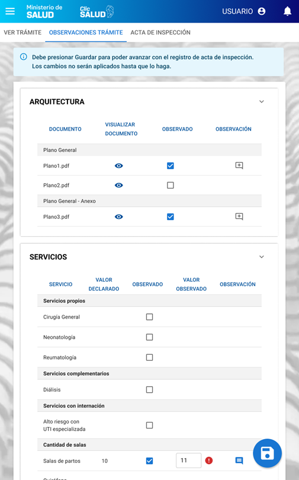
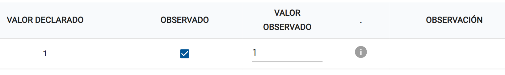

# 10.1.2 - Registrar Acta de Inspeccion - Observaciones trámite

> **Como** usuario con perfil autorizado (Agente inspector)  
> **Quiero** registrar datos y documentación correspondiente al acta de inspección  
> **Para** dejar registro de la inspección realizada.  

## 📝 DESCRIPCIÓN
Esta funcionalidad permite al Agente Inspector registrar desde un dipositivo movil, el resultado de su inspección, marcando observaciones en los campos del trámite 

Esta funcionalidad podrá ser accedida haciendo clic en el icono de “Acta Inspección” de la bandeja de trámites. O también podrá acceder desde el visualizar trámite haciendo clic en la solapa Acta de Inspección.

El trámite debe estar en estado “Aceptado Documentación Auditoria”.
Si el trámite está en estado "Respuesta de Emplazamiento", al acceder a la funcionalidad de acta de inspección cambiara el estado automáticamente a "Aceptado Documentación Auditoria".

Si el trámite es del tipo Renovación o Modificación o corresponde a la tipología de Radiofísica se mostrará el modal indicado en el prototipo:
“Modal Acta de Inspección” - Agente

Si el usuario selecciona “No es necesario” el sistema mostrara otro modal solicitando ingrese una Nota de Cierre obligatoria previa a la generación de la resolución. Una vez ingresada la observación y haciendo clic en Aceptar el trámite pasa al estado “Aceptado Sin Inspección” y el sistema redirige a la pantalla de generación de resolución.

Si el usuario selecciona “Si, registrar acta” o el trámite es del tipo “Alta de Habilitación”, el sistema mostrará las pestañas del inspector:

1.	Pestaña “Observar Trámite”: permite al inspector visualizar los 4 apartados del trámite (Arquitectura, Servicios, Equipamientos, Recursos Humanos, Jefe de Servicios Documentación) dispuestos en contendores de tipo acordeón y por cada paso se muestra la información en formato de tablas. Se muestra:
    - Alerta: “Debe presionar Guardar para poder avanzar con el registro de acta de inspección. Los cambios no serán aplicados hasta que lo haga.”
    - Apartados, donde el inspector puede:
        - Marcar el check “Observado” en cualquier item.
        - Cargar el valor observado según corresponda, y se mostran iconos de acuerdo al valor ingresado y paso del trámite.
        - Botón [GUARDAR].

        Los apartados que se muestran dependen de la tipología del trámite:  

        |  TIPOLOGÍA /  APARTADO  |  Arquitectura  |  Servicios   |  Recursos Humanos | Jefe de Servicios |  Equipamientos | Documentos Adjuntos| 
        |:---:|:---:|:---:|:---:|:---:|:---:|:---:|
        |  Clinicas  | x | x | x | x | x | x |
        |  Geriátricos  | x |   | x |   | x | x |
        |  Centro Cirugía Ambulatoria  | x | x | x |  | x | x |
        |  Centro Salud Ambulatoria  | x | x | x |  | x | x |

  

A continuación, se detalla como se muestra la información en la grilla en cada acordeón:

### ARQUITECTURA
|  Documento |  Visualizar documento  |  Observado  |  Observación  |
|:---:|:---:|:---:|:---:|

### SERVICIOS
|  Servicio |  Valor declarado  |  Observado  |  Valor observado  | Observación  |
|:---:|:---:|:---:|:---:|:---:|

### RECURSOS HUMANOS
|  Servicio |  Tipo de plantel  | Area de desempeño  | Rol de desempeño  | Valor declarado  |  Observado  |  Valor observado  | Observación |
|:---:|:---:|:---:|:---:|:---:|:---:|:---:|:---:|

### JEFE DE SERVICIOS
|  Servicio |  Tipo de plantel  |  Valor declarado  |  Observado  |  Valor observado  | Observación |
|:---:|:---:|:---:|:---:|:---:|:---:|

### EQUIPAMIENTOS
|  Servicio/Sala |  Equipo  |  Valor declarado  |  Observado  |  Valor observado | Observación  |
|:---:|:---:|:---:|:---:|:---:|:---:|

### DOCUMENTOS ADJUNTOS
|  Documento |  Visualizar documento  |  Observado  |  Observación  |
|:---:|:---:|:---:|:---:|

  

IMPORTANTE:

Iconos a mostrar cuando se observa un registro, y se ingresa valor observado:

- Valor observado = valor declarado, no se permite agregar observación, se muestra icono gris y no se mostrará el icono para observaciones.

- Aplica para: Equipamientos, Recursos Humanos.
    + Valor observado > valor declarado, no se muestra icono.
    + Valor observado < valor declarado, se muestra icono rojo (error).

- Aplica para: Servicios (dentro de las subsecciones Cantidad de salas y Cantidad de camas-puestos).   
    + Valor observado > valor declarado, se muestra icono amarillo rojo (error).
    + Valor observado < valor declarado, se muestra icono amarillo (advertencia) .

- Aplica para: Jefe de Servicios.
    + Valor observado > valor declarado, se muestra icono amarillo (advertencia), se habilita la observación.
    + Valor observado < valor declarado, se muestra icono rojo (error).

## ✅ CRITERIOS DE ACEPTACIÓN

1. Cumplir con los criterios definidos en el documento de estilo.

2. Al acceder, el sistema debe mostrar las pestañas: “Ver Trámite”, "Observar Trámite" y "Acta de Inspección". Por defecto ingresa a la pestaña “Observar Trámite”.

### Pestaña "Ver Trámite"
3. Esta pestaña debe mostrar todos los pasos del trámite en modo solo lectura (deshabilitado).

### Pestaña "Observaciones trámite"
4. La interfaz debe estar optimizada para uso en dispositivos móviles (Tablets 1280x800 px), asegurando que todos los controles (botones, tablas, modales) sean táctiles y legibles.

5. Se muestra el botón flotante [GUARDAR CAMBIOS] en la esquina inferior derecha, que permite guardar los valores de la pestaña (contenga o no observaciones) y habilita la pestaña “ACTA DE INSPECCIÓN” para su edición.

6. Se muestra la alerta “Debe presionar Guardar para poder avanzar con el registro de acta de inspección. Los cambios no serán aplicados hasta que lo haga.”

7. Se muestran las pestañas de actas correspondientes al número de inspección. A partir del acta número 2, se muestra el acta anterior, accesible pero con su contenido deshabilitado para su edición.

8. Los apartados que se muestran dependen de la tipología del trámite, los mismos se muestran en la tabla que se encuentra en la descripción.

9.  Los apartados deben mostrarse desplegados por defecto al cargar la pestaña.

10.  Los apartados "Arquitectura" y "Documentos Adjuntos" deben mostrar una tabla con las columnas: "Documento", "Visualizar Documento" y "Observado".  - La columna "Visualizar Documento" debe contener un ícono que permita al inspector previsualizar el documento adjunto en un pop-up.  - La columna “Observado” debe contener checks.  - Y la columna “Observación” un icono para agregar observaciones (por defecto vacío).

11.  En los apartados “Arquitectura” y “Documentación”, cada documento debe mostrarse debajo del subtitulo correspondiente (tipo de documento o tipo de documento - anexo), con su nombre de archivo.

12.  Los documentos que se muestran en los apartados "Arquitectura" y "Documentación", son aquellos que se encuentran en estado OBSERVADO, RECHAZADO o tienen fecha vencida para el momento de la inspección. 

13. El apartado "Servicios", debe mostrar una tabla con las columnas: "Servicios", "Valor declarado", "Observado", "Observación".

14.  En el apartado “Servicios”, dentro de las subsecciones Servicios, Servicios complementarios y Servicios con Internación, se deben mostrar únicamente los servicios que fueron declarados por el efector, y las cantidades de salas, camas/puestos mayores a 1.

15.  En el apartado “Servicios”, dentro de las subsecciones Servicios, Servicios complementarios y Servicios con Internación, al marcar el check “Observado”, se debe habilitar únicamente el botón en la columna “Observación”.

16.  En el apartado “Servicios” (dentro de las subsecciones Cantidad de salas y Cantidad de camas-puestos) se deben habilitar, un campo numérico en la columna “Valor observado” y el icono “Observación” en la columna “Observación”.

17.  En el apartado “Servicios” (dentro de las subsecciones Cantidad de salas y Cantidad de camas-puestos), en “Valor observado”, si se ingresa un valor que es menor al declarado, se mostrará un ícono de advertencia (amarillo). Si es mayor, mostrará un ícono de error (rojo). El campo "Observación" es obligatorio si el check "Observado" está seleccionado.

19. Para todos los apartados, en “Valor observado”, si el valor es igual al declarado, se mostrará un ícono de advertencia (gris) y no se mostrará el icono para observaciones.

20. Para todos los apartados, por defecto, y cuando un ítem no tenga una observación cargada, el ícono deberá mostrarse sólo el contorno del mismo (vacío).

21. Para todos los apartados, al hacer clic en el icono de Observación, el sistema debe abrir un modal pop-up, que permita ingresar/editar el texto de la observación para ese ítem.

22. Para todos los apartados. Si un ítem ya tiene una observación guardada, el ícono del botón “Observación” debe cambiar y mostrarse lleno y en color primario.

23. El apartado “Equipamientos” debe agrupar por cantidades tipos de equipos cargados por el efector. Las columnas son “Servicio/Sala” (servicio relacionado al equipo), “Equipo” (nombre del equipo), “Valor declarado”, “Observado” (check), “Valor observado”, “Observación” (ícono). 

24. El apartado "Recuersos Humanos", debe mostrar una tabla con las columnas: "Servicio", "Tipo de plantel", "Area de desempeño", "Rol de desempeño", "Valor declarado", "Observado", "Valor observado" y "Observación".

25. Para los apartados “Equipamientos” y "Recuersos Humanos", en "Valor observado”, si el valor es menor al declarado, se mostrará un ícono de de error (rojo). Si es mayor, no se muestra icnos.

26. El apartado "Jefe de Servicios", El apartado "Jefe de Servicios" debe agrupar por cantidades de acuedo al Servicio y Tipo de plantel. Y se debe mostrar en una tabla con las siguientes columnas: "Servicio", "Tipo de plantel", "Valor declarado", "Observado", "Valor observado" y "Observación".

23. La pestaña se encuentra deshabilitada para su edición hasta que el inspector presione el botón [GUARDAR] en la pestaña “OBSERVACIONES TRÁMITE”.

#### Criterios de aceptación de seguridad (NO deben pasar, se deben probar principalmente desde la API)
1.  

## 🖼️ PROTOTIPOS DE INTERFAZ

#### Pantalla "Observaciones Trámite"

- Valor observado igual al valor declarado

- Acta de inspección n+1 con respuestas de emplazamiento validadas en el acta anterior. 

## 🧩 ELEMENTOS DEL PROTOTIPO

|  CAMPO  |  IMÁGEN  |  TIPO| 
|  :---:  |  :---  |  :---| 
|  Pestañas  |  Navegación  |  Permite alternar entre las vistas principales: "Ver Trámite", "Observaciones Trámite" y "Acta de Inspección".| 
|  Acordeón  |  Visualización  |  Agrupa las secciones (Arquitectura, Servicios, Equipamientos) permitiendo mostrar u ocultar su contenido.| 
|  Checkbox  |  Selección  |  Casilla para selección múltiple o binaria (Sí/No).| 
|  Input  |  Campo de texto  |  Campo de una sola línea para ingreso de datos numéricos.| 
|  Ícono ojo  |  Botón  |  Permite previsualizar un documento.| 
|  Ícono observación vacío  |  Botón  |  Permite crear una nueva observación| 
|  Ícono observación lleno  |  Botón  |  Permite editar o visualizar una observación existente.| 
|  Ícono Irregularidad  |  Visualización  |  Icono que denota que el valor observado es mayor al valor declarado.| 
|  Ícono Rectificación  |  Visualización  |  Icono que denota que el valor observado es menor al valor declarado.| 
|  Guardar cambios  |  Botón flotante  |  Permite guardar los cambios de la pestaña observaciones trámite y habilitar la pestaña “Actas de inspección”.| 

## 🔄 DIAGRAMA DE TRANSICIÓN DE ESTADOS

## 🕛 HISTORIAL DE CAMBIOS

|  VERSIÓN  |  FECHA  |  BREVE DESCRIPCIÓN  |  NOMBRE DEL AUTOR| 
|  :---:  |  :---  |  :---  |  :---| 
|  1  |  11/08/2024  |  Versión inicial del HU  |  Molina Martin| 
|  1.1  |  31/10/2024  |  Se modifica el criterio 9 indicando que, si se hace clic en el botón salir, no se perderán los cambios realizados. Se añade el criterio 11 indicando que, al adjuntar un archivo como Respuesta de Emplazamiento, el sistema lo guardara automáticamente. En caso de salir de la pantalla sin enviar, el sistema no borrara los Respuesta de Emplazamientos adjuntos.  |  Molina Martin|
|  1.2  |  17/05/2025  |  Se modifican los criterios donde si indicaba el tamaño máximo y la cantidad máxima de archivos permitidos, siendo esta un máximo de 10 archivos de 5MB cada uno. Se modifica el prototipo permitiendo ver el link de grabación de inspección virtual cargado por el agente y registrar un link para la subida de videos de observaciones solucionadas.  |  Molina Martin|
|  1.3  |  15/06/2025  |  Se modifica la palabra descargo por “Respuesta de emplazamiento” por pedido del cliente  |  Molina Martin| 
|  1.4  |  10/10/2025  |  Se modifica un dato de la columna en el prototipo Se modifica el criterio 2.  |  Molina Martin|
|  2  |  14/11/2025  |  Nueva versión de inspección. Se agrega la pestaña “Observar trámite”, irregularidades y rectificaciones, y el resumen de observaciones en la pestaña “Acta de inspección”.  |  Talavera, María Azul.| 
|  2.1  |  14/11/2025  |  Se agregan subapartados en las tablas de Arquitectura y Documentación adjunta, y las columnas “Observaciones”.  Se agregan las columnas “Servicio” y cantidad en Equipamientos.  |  Talavera, María Azul.| "
|  2.2  |  15/11/2025  |  Se agrega alerta y botón flotante en pestaña “Observaciones trámite”.  |  Talavera, María Azul.| 
|  2.3  |  07/01/2026  |  Se modifica la descripción agregando una tabla para diferenciar los apartados según tipología, y se agrega el criterio de aceptación correspondiente.|  Talavera, María Azul.| 
|  2.4  |  05/02/2026  |  Agrego Centros Quirúrgicos a la tabla de apartados por tipología en la descripción. |  Talavera, María Azul.| 
|  2.5  |  12/02/2026  |  Elimino los criterios correspondientes al modal  "Desea registrar un acta de inspección?" para los trámites de renovación y modificación ya que los mismos si requieren inspección. |  Talavera, María Azul.| 
|  2.6  |  06/03/2026  |  Elimino de la descripción y los criterios de aceptación referidos a actas de inspección, ya que estos pasan a otra HU.   Agrego los apartados de Jefe de Serivios y Recursos Humanos a la descripción y criterios.|  Gonzalo Albarracin| 
|  2.7  |  18/03/2026  |  Agrego Centros Salud Ambulatoria a la tabla de apartados por tipología en la descripción. |  Molina Martin| 