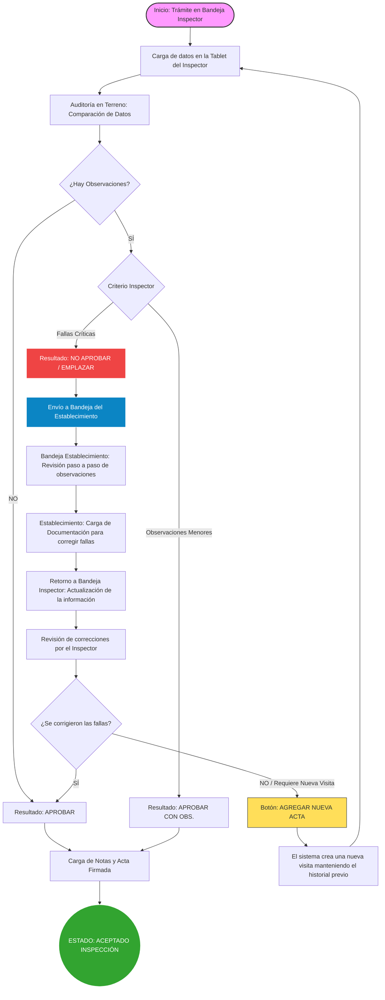

# Diagrama de Flujo: Proceso de Inspección y Fiscalización

Este documento describe el proceso de inspección, incluyendo la auditoría comparativa de los datos del establecimiento, el guardado de la información paso a paso y la comunicación entre el Inspector y el Responsable del Establecimiento.

## Índice de Historias de Usuario (HUs)

### Inspección en Terreno
*   [HU.01: Descarga de Información Inicial](./Inspeccicón/HU01_Inspeccion_Sincronizacion.md)
*   [HU.02: Auditoría de Infraestructura (Salas y Camas)](./Inspeccicón/HU02_Inspeccion_Infraestructura.md)
*   [HU.03: Verificación de Equipamiento Técnico](./Inspeccicón/HU03_Inspeccion_Equipamiento.md)
*   [HU.04: Validación de Personal y Jefes de Servicio](./Inspeccicón/HU04_Inspeccion_RRHH.md)
*   [HU.05: Gestión de Observaciones y Evidencias](./Inspeccicón/HU05_Inspeccion_Observaciones.md)
*   [HU.06: Cierre de Inspección y Generación de Acta](./Inspeccicón/HU06_Inspeccion_Cierre.md)

### Rectificación y Descargo (Establecimiento)
*   [HU.07: Revisión de Hallazgos de la Inspección](./Respuesta%20Emplazamiento/HU07_RespuestaEmplazamiento_Revision.md)
*   [HU.08: Carga de Documentación de Correcciones](./Respuesta%20Emplazamiento/HU08_RespuestaEmplazamiento_Subsanacion.md)
*   [HU.09: Envío de Respuestas y Notificación Final](./Respuesta%20Emplazamiento/HU09_RespuestaEmplazamiento_Envio.md)

---

## Flujo del Proceso

## Características del Proceso

1. **Auditoría Comparativa**: En la visita al efector, el inspector compara tres tipos de información: los datos declarados originalmente en el trámite, las modificaciones informadas por el establecimiento, y lo que él mismo constata viendo el lugar.
2. **Guardado Continuo**: Durante todo el proceso, la información se guarda automáticamente en el dispositivo. Esto asegura que no se pierdan datos si hay cortes de internet y permite retomar el trabajo en cualquier momento.
3. **Carga Guiada para el Efector**: La plataforma guía al Responsable del Establecimiento paso a paso para que pueda responder a cada una de las observaciones indicadas por el inspector de manera ordenada y sencilla.
4. **Historial de Decisiones**: Todo el proceso mantiene un registro detallado de los cambios y decisiones tomadas en cada etapa (sobre infraestructura, equipos y personal), lo que permite tener un seguimiento claro y transparente del expediente.
