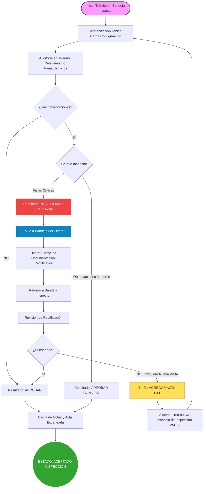

# Flujo del Proceso de Inspección y Fiscalización

Este diagrama describe los posibles estados y caminos que puede tomar un trámite durante el ciclo de inspección técnica, desde la auditoría inicial hasta la resolución final.

### Descripción de los Caminos:

1.  **Camino Feliz (Aprobación Directa)**: El inspector no encuentra inconsistencias. Cierra el acta y el trámite finaliza su ciclo de fiscalización exitosamente.
2.  **Aprobación con Observaciones**: Existen detalles menores que no impiden la habilitación. Se registran para seguimiento futuro pero se aprueba el trámite.
3.  **Emplazamiento y Rectificación**: Se encuentran fallas graves. El efector recibe el trámite, debe subir archivos y descargos que prueben la corrección de las faltas. Una vez enviado, el inspector vuelve a evaluar.
4.  **Ciclo de Re-Inspección**: Si la rectificación digital no es suficiente o se requiere una nueva visita física, el inspector genera una "Acta N+1", lo que reinicia el proceso de auditoría manteniendo el historial del acta anterior.
